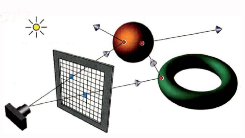

# Rei_Tracer
miniRT project from 42 (evangelion reference)

For faster (parallel) builds do:
```export MAKEFLAGS="-j$(nproc)"```.

By default ```make``` for your current session will use these flags.
Sometimes this causes ```make re``` to fail: worry not, just retry one more time!

### Description

Ray tracing is a render tecnique by shooting a ray. In the image is show how it works, the camera and the window of pixels rappresenting how it should work. When we cast a ray whe ask how much light is reflected to compute the pixel's color.




The animated film industry rely heavily on ray tracing, not only for visual effect, a lot of film were fully rendered using ray tracing tecniques, for example Frozen and Ice Ace.

Nowdays computer whith a good graphic card can render a fully ray-traced videogames like Cyberpunk 2077.

This project help us to understand the apperence of the world around us. Because we simulate how lights and color works when we see things.

### Instructions

to compile:

```terminal
make mlx && make
```

to execute:
```terminal
./miniRT test.rt
```

### Resources

Thanks a lot to:
https://www.scratchapixel.com/
https://raytracing.github.io/books/RayTracingInOneWeekend.html